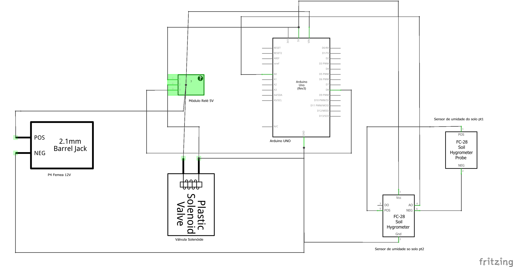

# Rega Automatizada
Marcos Dionísio Fernandes Pátria - 31954275
 
Vitor Henrique Vieira da Silva - 31886574

# Sobre o projeto
Projeto acâdemico desenvolvido na disciplica de OBJETOS INTELIGENTES CONECTADOS da Universidade Presbiteriana Mackenzie, orientado pelo Prof. Dr. Wilian França Costa.
 
Tecnologia em Ánalise e Desenvolvimento de Sistemas - 5º Semestre/2021
# Uso e Funcionamento
O projeto tem como objetivo minimizar o esforço humano e manter suas plantas e hortaliças sempre regadas.
 
 
Para que tudo isso funcione precisamos montar os componentes de acordo com o <a href="https://github.com/vitaohvs/RegaAutomatizada/blob/9250b0e3e420df0672df20511278835730cef586/circuito_eletronico.png">Circuito eletrônico</a>.
 
 
Tudo começa no sensor de umidade que está submerso no solo do vaso da planta, onde ele estará a todo momento captando o valor da umidade do solo, retornando um número inteiro para o Arduino onde está conectado. 
 
Este número é interpretado da seguinte maneira:
 
 • Quanto mais próximo de 0, mais úmido o solo está.
  
 • Quanto mais próximo de 1000, mais seco o solo está.
  
No nosso caso, utilizamos a medida para identificação de solo seco quando umidade > 600.
 
 
Quando o Arduino Uno receber esse valor da umidade, ele irá comparar se umidade > 600. Caso seja maior, ele sinalizará o módulo relé para que libere a corrente elétrica da fonte de 12V para a válvula solenóide, assim liberando o fluxo de água para o vaso. Caso contrário ele mantém a corrente elétrica fechada.
 
 
Por fim, a umidade do solo também é enviada através do protocólo MQTT, onde por sua vez o usuário consegue visualizar no Node-Red um gráfico das mudanças da umidade do solo, a umidade atual e se a válvula solenóide está aberta ou fechada.

# Software desenvolvido
O código desenvolvido que foi gravado no Arduino é o <a href="https://github.com/vitaohvs/RegaAutomatizada/blob/ee63eff638df5301a409dd94641cb1dd563381e9/StandardFirmata.ino">StandardFirmata</a>. Utilizamos o código do Firmata sem nenhum tipo de edição.
 
Toda a lógica de funcionamento do projeto foi desenvolvida através da ferramenta Node-Red, que está detalhado no tópico de Interfaces, protocolos e módulos de comunicação.

# Hardware utilizado
 • Arduino Uno
 • Cabo Micro USB
 • Sensor de umidade do solo higrômetro
 • 3 Jumpers Macho-Macho
 • 5 Jumpers Fêmea-Fêmea
 • 5 Jumpers Macho-Fêmea
 • Módulo Relé 5V
 • Fonte 12V
 • Adaptador P4 Fêmea
 • Válvula solenóide 12V
 
# Interfaces, protocolos e módulos de comunicação.
O projeto conta com uma interface amigável que foi desenvolvida usando a ferramenta Node-Red, que simplifica o desenvolvimento "ligando" de blocos de código para executas tarefas.
  

# Links
<a href="https://github.com/vitaohvs/RegaAutomatizada/blob/9250b0e3e420df0672df20511278835730cef586/circuito_eletronico.png">Circuito eletrônico</a>
